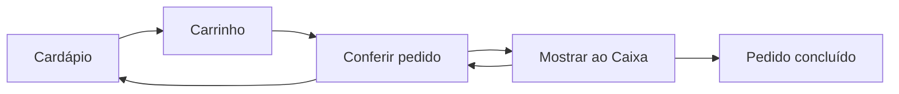

# Festa Junina da Oikos — Cardápio Digital

Cardápio digital para a **Festa Junina da Oikos**: uma página pensada para o celular, onde o visitante monta o pedido, confere no carrinho e mostra a tela ao caixa para pagar na hora.

Sem cadastro. Sem pagamento online. Sem complicação.

---

## Por que existe

Em uma festa junina, filas e ruído atrapalham pedidos no balcão. Este projeto resolve isso com um fluxo simples:

1. A pessoa escolhe os itens no próprio celular
2. Confere quantidades e valores antes de ir ao caixa
3. Mostra o recibo na tela para o atendente
4. Paga presencialmente e finaliza o pedido no app

A interface foi pensada para **todas as idades** — crianças, adultos e idosos — com botões grandes, textos claros e poucos passos.

---

## Como funciona



| Etapa | O que o visitante faz |
|-------|------------------------|
| **Cardápio** | Rola pelas seções (placas de categoria), usa **+** e **−** nos produtos |
| **Carrinho** | Barra fixa no rodapé com total de itens e valor |
| **Conferir pedido** | Revisa, edita ou remove itens; **Limpar Pedido** só aparece com itens |
| **Mostrar ao Caixa** | Recibo em fonte grande para o caixa ler |
| **Pedido concluído** | Após pagar, limpa o pedido e volta ao cardápio |

O pedido fica salvo no **localStorage** do navegador — se a página recarregar, a seleção não se perde.

---

## O que foi feito

- Página única responsiva (celular, tablet e desktop)
- Cardápio com **6 categorias**: Salgados, Lanches, Bebidas, Doces, Bolos e Brincadeiras
- Lista de produtos **só texto** (sem miniaturas)
- Identidade visual de festa junina artesanal (papel kraft, bordas tracejadas, placa de madeira, bandeirinhas em CSS)
- Painel de conferência com edição de quantidades
- Tela de recibo para o caixa com preço unitário e total
- Textos e passos configuráveis em um único arquivo JSON
- Site estático, pronto para deploy (Vercel, Netlify, etc.)

---

## Como foi feito

### Stack

| Tecnologia | Uso |
|------------|-----|
| [Next.js 16](https://nextjs.org/) | App Router, página estática, metadata e Open Graph |
| [React 19](https://react.dev/) | Interface e estado do pedido |
| [TypeScript](https://www.typescriptlang.org/) | Tipagem do cardápio e do pedido |
| [Tailwind CSS 4](https://tailwindcss.com/) | Layout responsivo |
| CSS customizado | Tokens de cor, bordas tracejadas e componentes visuais |

Sem backend, banco de dados ou dependências extras.

### Arquitetura

```
app/              → página, layout, estilos globais
components/
  layout/         → cabeçalho, instruções, container
  menu/           → cardápio, categorias, produtos
  order/          → carrinho, painel, recibo do caixa
context/          → estado global do pedido
data/             → menu.json (cardápio e textos do evento)
hooks/            → useOrder
lib/              → lógica de pedido, moeda, persistência
public/
  backgrounds/    → fundo xadrez
types/            → tipos TypeScript
```

**Separação de responsabilidades:**

- `data/menu.json` — conteúdo (produtos, preços, textos)
- `lib/order.ts` — regras do pedido (totais, quantidades)
- `context/OrderProvider.tsx` — estado em memória + localStorage
- Componentes — só apresentação e interação

---

## Como rodar

### Pré-requisitos

- [Node.js](https://nodejs.org/) 20 ou superior
- npm (vem com o Node)

### Desenvolvimento

```bash
# clone o repositório e entre na pasta do app
cd website

# instale as dependências
npm install

# suba o servidor local
npm run dev
```

Abra [http://localhost:3000](http://localhost:3000) no navegador.

### Produção

```bash
npm run build   # gera o build estático
npm run start   # serve o build localmente
npm run lint    # verifica o código
```

### Deploy

O projeto gera páginas estáticas. Para publicar na [Vercel](https://vercel.com), conecte o repositório e use a pasta `website` como raiz do projeto.

Opcional: defina `NEXT_PUBLIC_SITE_URL` com a URL pública do site (usada em metadata e Open Graph).

---

## Como editar o cardápio

Tudo que aparece na tela do evento está em **`data/menu.json`**:

```json
{
  "evento": {
    "nome": "Festa Junina da Oikos",
    "subtitulo": "Cardápio Oficial",
    "mensagens": ["...", "..."],
    "data": "27 de Junho",
    "horario": "19h",
    "passos": ["...", "..."],
    "observacao": "..."
  },
  "categorias": [
    {
      "id": "salgados",
      "nome": "Salgados",
      "icone": "🍽️",
      "itens": [
        {
          "id": "pastel",
          "nome": "Pastel",
          "preco": 10,
          "descricao": "Carne ou Queijo"
        }
      ]
    }
  ]
}
```

- **`descricao`** (opcional) — variantes ou sabores (ex.: "Coca, Coca Zero")
- **Ordem das categorias:** definida em `lib/menu.ts` (Salgados → Lanches → Bebidas → Doces → Bolos → Brincadeiras)

**Brincadeiras** ficam na última categoria (`id`: `atracoes`), com itens no mesmo formato das comidas — ex.: `"Bingo — 1 cartela"`, `"Cadeia — 10 minutos"`.

---

## Identidade visual

| Elemento | Detalhe |
|----------|---------|
| **Tema** | Festa junina artesanal — scrapbook, papel kraft, quermesse |
| **Fontes** | Bree Serif (títulos) + Nunito (texto) |
| **Cores** | Laranja `#D96A1D`, vermelho `#B03A2E`, amarelo `#F5C242`, verde `#4E8C4A`, creme `#F7E7C6`, kraft `#8B5E3C` |
| **Fundo** | Tecido xadrez (`public/backgrounds/junina-background.png`) |
| **Cabeçalho** | Bandeirinhas em CSS |

Tokens e classes visuais em `app/globals.css`. Detalhes em `../design/`.

---

## O que não tem (de propósito)

- Login ou cadastro
- Pagamento online
- Backend ou API
- Banco de dados
- Painel administrativo
- Imagens de produto na lista

O caixa recebe o pagamento presencialmente; o app só organiza e exibe o pedido.

---

## Licença

Projeto privado da Festa Junina da Oikos. Uso conforme definido pelos organizadores do evento.
